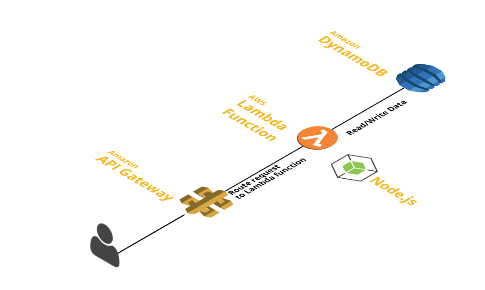

# Avocado
==========

Boilerplate for building RESTful API with Node.js, Express and DynamoDB. Deployed in a server-less way to AWS Lambda and AWS API Gateway using Claudia.js and dev local using gulp

Architecture
------------

Simple REST API deplyed in AWS Lambda persisting data into DynamoDB and retrieving data back.

